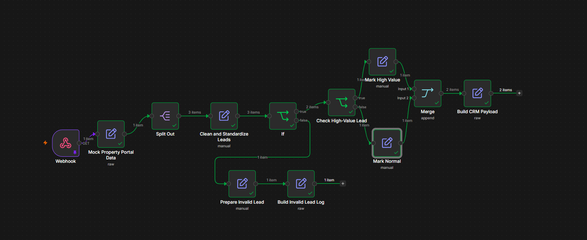
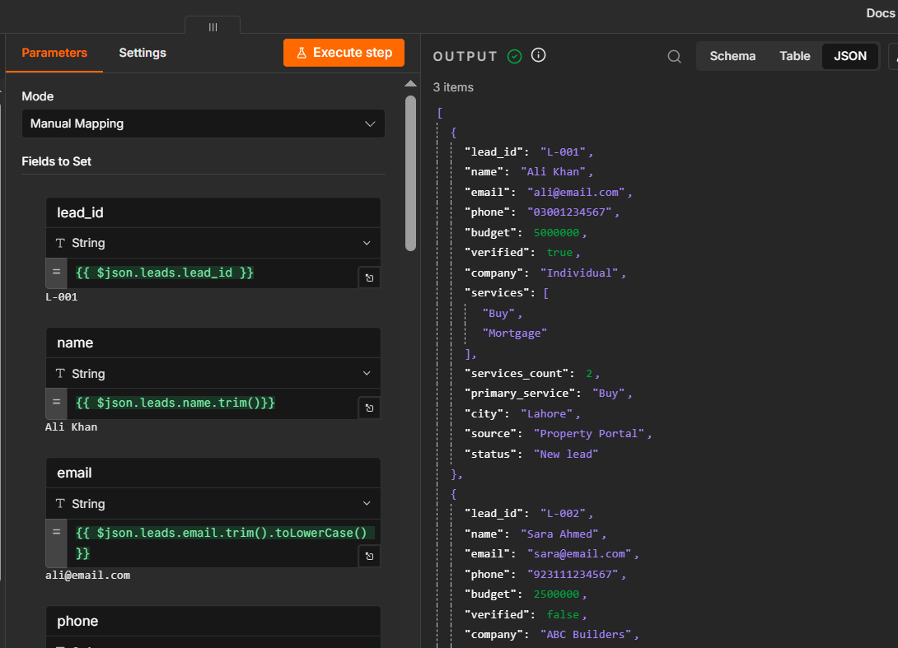
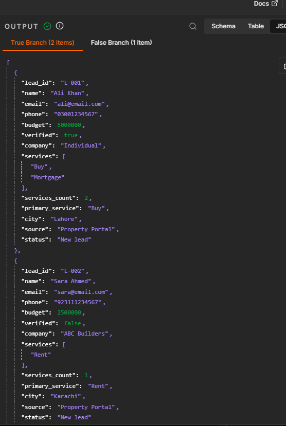
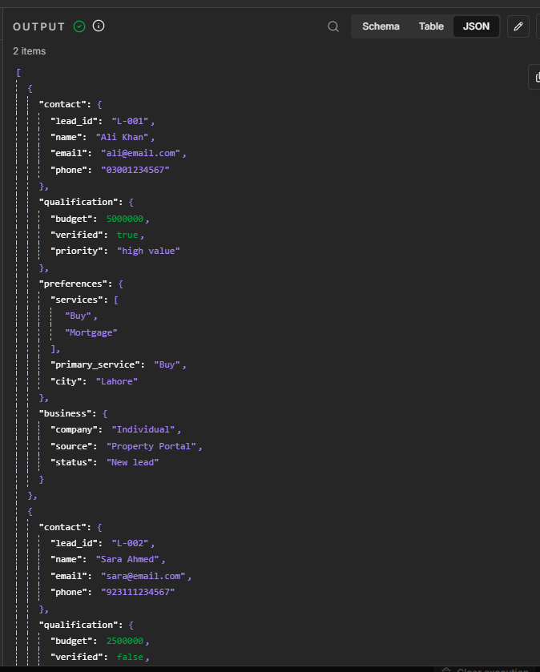
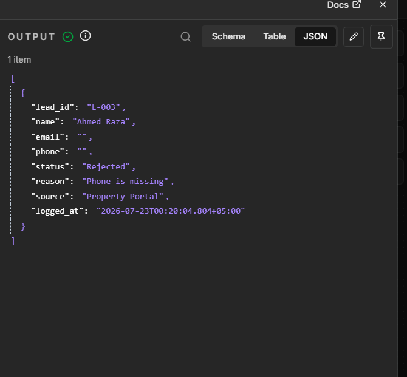

# n8n Property Lead Processing Workflow

A rule-based n8n workflow for processing batch property leads, cleaning inconsistent customer data, validating required fields, assigning lead priority, generating CRM-ready JSON, and logging rejected leads.

## Project Overview

Property businesses often receive customer leads from websites, advertising platforms, property portals, and external systems. Raw lead data may contain:

- Extra spaces
- Uppercase email addresses
- Formatted phone numbers
- Numeric values stored as strings
- Missing customer information
- Empty arrays
- Null company values
- Multiple leads inside one batch

This workflow processes and standardizes such data automatically.

## Workflow Architecture

```text
Receive Lead Batch
        ↓
Mock Property Portal Data
        ↓
Split Lead Batch
        ↓
Clean and Standardize Leads
        ↓
Validate Required Fields
       / \
 Invalid   Valid
    ↓        ↓
Prepare    Check High-Value Lead
Invalid       /              \
Lead      High Value        Normal
    ↓           ↓               ↓
Build       Mark High        Mark Normal
Invalid      Value              Lead
Lead Log       \               /
                   Merge
                     ↓
              Build CRM Payload
```

## Workflow Overview

The workflow receives one batch containing multiple lead objects. It separates each lead, cleans the data, validates required fields, routes valid leads according to budget, and sends invalid leads to a structured error-log path.



## Data Cleaning and Standardization

The workflow performs the following transformations:

- Removes extra spaces from customer names
- Converts email addresses to lowercase
- Removes spaces, hyphens, and symbols from phone numbers
- Converts budget values from strings to numbers
- Converts verified values from strings to booleans
- Replaces missing company values with `Individual`
- Preserves service selections as an array
- Counts selected services
- Extracts the primary service
- Extracts city from a nested address object



## Validation and Routing

Each lead is validated using fixed business rules.

A lead is accepted when:

- Name is not empty
- Phone number is not empty
- Budget contains a valid numeric value

Invalid leads are sent to a separate rejection and logging path.



## Lead Priority Classification

Valid leads are classified using this deterministic rule:

```text
Budget greater than or equal to 3,000,000 → High Value
Budget below 3,000,000                    → Normal
```

This decision does not require AI because the business condition is clear and rule-based.

## CRM-Ready JSON Payload

Valid leads are converted from flat records into a structured nested JSON payload containing:

- Contact information
- Qualification information
- Property preferences
- Business metadata


Example structure:

```json
{
  "contact": {
    "lead_id": "L-001",
    "name": "Ali Khan",
    "email": "ali@email.com",
    "phone": "03001234567"
  },
  "qualification": {
    "budget": 5000000,
    "verified": true,
    "priority": "High Value"
  },
  "preferences": {
    "services": ["Buy", "Mortgage"],
    "primary_service": "Buy",
    "city": "Lahore"
  },
  "business": {
    "company": "Individual",
    "source": "Property Portal",
    "status": "New Lead"
  }
}
```

## Invalid Lead Logging

Rejected leads receive:

- Lead identification
- Processing status
- Specific rejection reason
- Original source
- Processing timestamp


Example:

```json
{
  "lead_id": "L-003",
  "name": "Ahmed Raza",
  "email": "",
  "phone": "",
  "status": "Rejected",
  "reason": "Phone is missing",
  "source": "Property Portal",
  "logged_at": "2026-07-23T00:20:04.804+05:00"
}
```

## Nodes Used

- Webhook
- Edit Fields
- Split Out
- IF
- Merge

## JSON Concepts Demonstrated

- Strings
- Numbers
- Booleans
- Null values
- Arrays
- Objects
- Arrays of objects
- Nested JSON paths
- Array indexing
- Array length
- Type conversion
- Default values
- Multiple n8n items
- Flat-to-nested JSON transformation

## Test Scenarios

| Scenario | Expected Result |
|---|---|
| Complete high-budget lead | Accepted as High Value |
| Complete lower-budget lead | Accepted as Normal |
| Missing phone number | Rejected |
| Missing customer name | Rejected |
| Invalid budget value | Rejected |
| Budget equal to 3,000,000 | Accepted as High Value |
| Empty services array | Processed with `No service` |
| Missing company | Converted to `Individual` |

## Repository Files

```text
property-lead-processing-workflow.json
sample-input.json
sample-valid-output.json
sample-invalid-output.json
Screenshots/
```

### File Descriptions

- `property-lead-processing-workflow.json` — Importable n8n workflow
- `sample-input.json` — Example raw property-lead batch
- `sample-valid-output.json` — Example CRM-ready valid lead output
- `sample-invalid-output.json` — Example rejected lead log
- `Screenshots/` — Workflow and output screenshots

## How to Import the Workflow

1. Download `property-lead-processing-workflow.json`.
2. Open n8n.
3. Create a new workflow.
4. Open the workflow menu.
5. Select **Import from File**.
6. Select the downloaded JSON file.
7. Review the node settings.
8. Execute the workflow using dummy data.

## Demo Input

This portfolio version uses simulated property-portal data. Therefore, the workflow can be imported and tested without external accounts or credentials.

## Real Client Adaptation

In a production environment, the mock-data node would be replaced by data received from a website, form, CRM, or property portal through a POST webhook.

Example webhook body:

```json
{
  "source": "Property Portal",
  "campaign_id": "CMP-2026-07",
  "leads": [
    {
      "lead_id": "L-001",
      "name": "Ali Khan",
      "email": "ali@example.com",
      "phone": "03001234567",
      "budget": "5000000",
      "verified": "true",
      "company": null,
      "services": ["Buy"],
      "address": {
        "city": "Lahore",
        "country": "Pakistan"
      }
    }
  ]
}
```

The remaining cleaning, validation, routing, and payload-generation logic can be reused after mapping the webhook body.

## Workflow Type

```text
Standard Rule-Based Automation
```

AI is not required because all current decisions use clear and deterministic business rules.

## Future Improvements

- Store valid leads in a CRM
- Save rejected leads in Google Sheets or a database
- Add duplicate lead detection
- Send sales-team notifications
- Add webhook authentication
- Return a processing summary
- Add API retry handling
- Add technical-error alerts
- Replace mock data with a live POST webhook integration

## Security

This repository contains only dummy data.

It does not contain:

- API keys
- Access tokens
- Passwords
- Real customer information
- Private webhook URLs
- Client credentials

## Author

Created as part of practical n8n automation engineering training.
